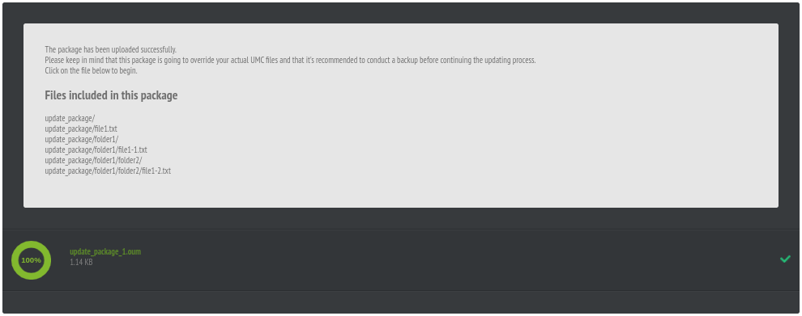

# Update Manager Client

## Introduction

This library is the client side of the Update Manager project from Artica PFMS.

Allows update files in _on-premise_ PHP projects and apply database upgrades on them.

## How to use

Update manager client allows package updates in OUM format.

This OUM packages are _zip_ files.

To generate an update pack you should zip all files in the way you want them to be in your installation:

```bash
$ tree update_package
update_package/
├── file1.txt
└── folder1
    ├── file1-1.txt
    └── folder2
        └── file1-2.txt

2 directories, 3 files

$ cd update_package && zip -r update_package_1.oum ./
  adding: file1.txt (stored 0%)
  adding: folder1/ (stored 0%)
  adding: folder1/file1-1.txt (stored 0%)
  adding: folder1/folder2/ (stored 0%)
  adding: folder1/folder2/file1-2.txt (stored 0%)

```

Create a file to handle updates with following content

```php
<?php
/**
 * Sample file to perform offline updates.
 */

require_once "vendor/autoload.php";
use UpdateManager\UI\Manager;

$umc = new Manager(
  // Whatever is placed in url after host name.
  public_url: "/",
  settings: [
    "homedir" => __DIR__,
    "allowOfflinePatches" => true,
  ],
  mode: Manager::MODE_OFFLINE,
  composer: true
);
$umc->run();
```

By accessing the file via URL, you can use the offline updater:



Press the green area to start the update.

You will receive a summary of the installation process.

If success, then files and folders will be recreated under _homedir_ path.

### Links

More information:

https://pandorafms.com/manual/en/documentation/02_installation/02_anexo_upgrade?s[]=update&s[]=manager#automatic_update_with_update_manager

https://pandorafms.com/en/
